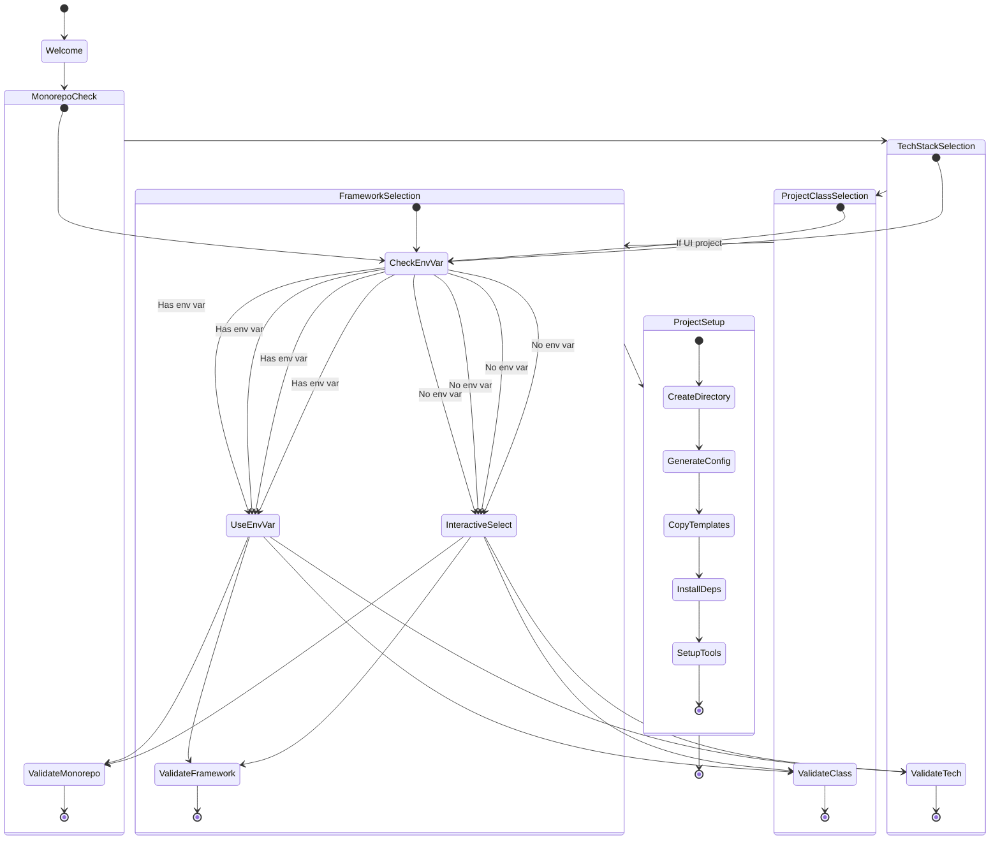

# 🚀 Bootstrap Script Workflow

## 📊 State Flow Diagram



## 🔄 Process Flow

1. **Welcome Phase**
   - Display welcome message
   - Initialize environment

2. **Monorepo Check**
   - Check for `MONOREPO` environment variable
   - If not set, prompt user
   - Validate monorepo configuration

3. **Tech Stack Selection**
   - Check for `TECH` environment variable
   - If not set, present interactive menu
   - Validate selected technology

4. **Project Class Selection**
   - Check for `CLASS` environment variable
   - If not set, present interactive menu
   - Validate selected class based on tech stack

5. **Framework Selection** (UI projects only)
   - Check for `FRAMEWORK` environment variable
   - If not set, present interactive menu
   - Validate selected framework

6. **Project Setup**
   - Create project directory
   - Generate configuration files
   - Copy and process templates
   - Install dependencies
   - Set up development tools

## ⚠️ Error Handling

Each state should handle:
- Invalid user input
- Missing environment variables
- File system errors
- Dependency installation failures
- Template processing errors

## 🔧 Environment Variables

```bash
# Core Configuration
TECH="node|rust|go"          # Technology stack
CLASS="api|ui|lib|cli"       # Project class
MONOREPO="true|false"        # Monorepo setup

# UI Project Specific
FRAMEWORK="next|astro|vite"  # UI framework
COMPONENTS="js|ts"           # Web components type
STATE="xstate|redux|mobx"    # State management
```

## 📝 Notes

- All interactive prompts should have non-interactive fallbacks
- Environment variables take precedence over interactive selection
- Each state should validate its inputs before proceeding
- Error handling should be consistent across all states
- Template processing should be atomic (rollback on failure) 