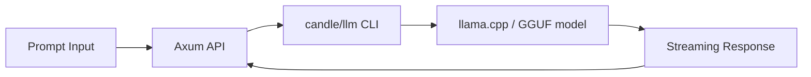

Here's a **complete guide for running and fine-tuning quantized LLMs locally** on your **M4 Max MacBook Pro** using **Ollama** and **llama.cpp**. This setup plays into your Rust-based workflow and prioritizes **local inference**, **lightweight fine-tuning**, and **AI agent development**.

---

## **Guide: Run & Fine-Tune Quantized LLMs Locally**

---

### **PART 1: Local Inference – Quick Setup**

#### **Option A: [Ollama] – Fastest Setup for Local LLMs**
Ollama simplifies downloading and running quantized LLMs (like LLaMA, Mistral, etc.) in seconds.

**Install:**
```sh
brew install ollama
```

**Run a model (e.g. Mistral):**
```sh
ollama run mistral
```

**List available models:**
```sh
ollama list
```

**Pull a quantized model:**
```sh
ollama pull llama2:7b
```

**Run chat interface:**
```sh
ollama run llama2
```

**Use in code (via HTTP API):**
```ts
// POST http://localhost:11434/api/generate
{
  "model": "llama2",
  "prompt": "What is the future of Web3 UX?"
}
```

**Pros:**
- Plug-and-play
- GPU acceleration on macOS
- Supports `modelfile` for custom fine-tuning

**Cons:**
- Limited to supported models
- Custom fine-tuning is via `modelfile`, not full training

---

#### **Option B: [llama.cpp] – Maximum Flexibility, Rust-Compatible**

Llama.cpp compiles quantized LLMs to run on CPU/GPU via Metal (Apple Silicon).

**Clone and build:**
```sh
git clone https://github.com/ggerganov/llama.cpp
cd llama.cpp
make LLAMA_METAL=1
```

**Run a quantized GGUF model:**
```sh
./main -m ./models/llama-2-7b-chat.Q4_K_M.gguf -p "Write a summary of DeFi innovations in 2024"
```

**What is a Quantized GGUF Model? (Simplified)**

*   **LLMs are Huge:** Large Language Models (like LLaMA, Mistral) have billions of parameters (think of them as internal knobs and dials). Storing and running them needs a lot of computer memory (RAM and graphics card VRAM) – often more than available on consumer laptops.
*   **Quantization = Shrinking:** Quantization is a technique to make these models much smaller. It reduces the precision of the numbers used for the parameters (e.g., using simpler numbers like `3.14` instead of highly detailed ones like `3.14159265...`). This is like compressing an image – you lose a tiny bit of detail, but the file size becomes much more manageable.
*   **Benefits:** Smaller models run faster and use significantly less memory, making it possible to run powerful models directly on your MacBook.
*   **GGUF = The File Format:** GGUF is the specific file format used by `llama.cpp` to store these smaller, quantized models. It packages everything needed (the model structure and the compressed parameters) into a single `.gguf` file.

**GUI Frontend (Optional):**
- [LM Studio](https://lmstudio.ai)
- [GPT4All Desktop](https://gpt4all.io)

**Pros:**
- Works offline
- Works well with `candle` and `burn` backends
- Open format (`.gguf`)

**Cons:**
- Manual setup
- CLI-focused

---

### **PART 2: Fine-Tuning Locally (Lightweight, QLoRA Style)**

Apple Silicon is not ideal for full model training, but you can **fine-tune adapters or embeddings**:

#### **1. Lightweight Fine-Tuning Methods**
- **LoRA/QLoRA**: Add adapter layers, freeze base model.
- **Embedding Fine-Tuning**: Customize for your use case.
- **RAG (Retrieval-Augmented Generation)**: No need to fine-tune, use vector search + context.

#### **2. Fine-Tune with Ollama (Modelfile)**
Ollama supports basic prompt fine-tuning with a `Modelfile`.

**(Note:** The filename is typically `Modelfile` with a capital 'M', though Ollama might be flexible).**

**Example:**
```Dockerfile
FROM llama2

SYSTEM "You are an expert Web3 agent."

PROMPT "How can I integrate NFTs into a budgeting app?"

# Save this as Modelfile and run:
ollama create my-web3-agent -f Modelfile
```

#### **3. Fine-Tune with llama.cpp + LoRA Tools**
Use Python-based LoRA tools (e.g., `qlora`, `axolotl`) to fine-tune adapters for a base model, then potentially quantize the *base model* to GGUF for efficient inference.

- Start with [Axolotl](https://github.com/OpenAccess-AI-Collective/axolotl) or similar tools for LoRA training.
- You'll train small "adapter" files (not a whole new model).
- The base model (e.g., Llama2) is typically quantized separately to GGUF using `llama.cpp` tools.

> **Using LoRA Adapters with Rust (`candle`, `burn`): Explanation**
> 
> When you fine-tune using LoRA, you get small adapter files that modify the behavior of the larger base model (like Llama2).
> 
> If you want to run inference in Rust using the `candle` or `burn` frameworks, they need specific code (a "loader") to perform these steps:
> 1.  Load the main, quantized base model (the `.gguf` file).
> 2.  Load the separate LoRA adapter file(s) you trained.
> 3.  Intelligently merge or apply the adapter's modifications to the base model *during* the inference calculation.
> 
> As of late 2024 / early 2025, built-in support for loading *external* LoRA adapter files alongside a GGUF base model might still be developing in `candle`/`burn`. Implementing this loading and merging logic might require custom Rust development within your project – hence, "we can build this together!" if needed.

---

### **PART 3: Developer Toolchain Setup (Rust-Friendly)**

Here's a dev setup for working with local LLMs and Rust:

| Tool | Purpose | Install |
|------|---------|---------|
| `ollama` | Serve quantized models | `brew install ollama` |
| `llama.cpp` | Compile & run GGUF models | `make LLAMA_METAL=1` |
| `lmstudio` | GUI + API for models | [lmstudio.ai](https://lmstudio.ai) |
| `candle` | Rust ML inference engine | `cargo add candle` |
| `burn` | Rust ML training | `cargo add burn` |
| `llm` | Rust CLI for GGUF inference | `cargo install llm` |
| `axum` | Serve agents via Rust API | `cargo add axum` |
| `just` | Automate scripts | `cargo install just` |

---

### **PART 4: Your Ideal Workflow for Local Agents**



You can:
- Build a **Rust API server with Axum**
- Load GGUF model via `llm` CLI or `candle`
- Create LLM agents using local inference
- Serve multiple roles per endpoint (e.g. "web3 assistant", "client scoper") 

---

### **PART 5: Relevance to MVP_Kit**

This local LLM setup guide is fundamental to the `MVP_Kit` project's architecture and goals:

1.  **Core Goal:** `MVP_Kit` aims to automate MVP generation using AI agents. Relying on local models ensures privacy, reduces API costs, enables offline development, and allows for rapid iteration.
2.  **Chatbot System Backend:** The Rust-based **"Chatbot System"** described in `MVP_Kit/PROMPT.md` is the primary consumer of this local LLM infrastructure. It will likely use tools like `ollama`, `llama.cpp`, `candle`, and `axum` (as outlined in PART 3 & 4) to serve models and provide an inference API for the various agents.
3.  **Agent Interaction:** Agents defined in `MVP_Kit` (like `onboarding-agent`, `scoping-agent`, and future specialized `mvp-agent-*` implementations based on scaffolds like `rust-agent`) will interact with this local LLM service (likely via the Axum API) to perform their tasks (clarifying specs, defining scope, generating code, etc.).
4.  **Flexibility with Option B (llama.cpp/GGUF):** While Ollama (Option A) is great for quick starts, the `llama.cpp`/GGUF approach (Option B) offers the flexibility often needed for `MVP_Kit`. It allows using a wider range of community-quantized models and provides a clearer path for potentially integrating custom fine-tuned adapters (LoRA) directly within the Rust `candle`/`burn` ecosystem, even if it requires some custom loader development (as mentioned in PART 2).
5.  **Scaffolding Support:** The `dev-setup` bootstrap scripts can create standard agent scaffolds (e.g., `just bootstrap-rust-agent`). These agents are designed to plug into the LLM service built using the principles in this guide. 

---

## **PART 6: Additional Considerations & Best Practices**

### **6.1 Performance & Testing**

1. **Benchmarking & Profiling:**
   - Use [`hyperfine`](https://github.com/sharkdp/hyperfine) or built-in Rust benchmarking to test response times under different quantization levels (Q4, Q5, Q8, etc.).
   - For concurrency tests, spin up multiple requests via `wrk` or `locust` to measure throughput, latency, and memory usage.

2. **Unit & Integration Tests:**
   - **Integration Tests:** For your Rust-based inference server (e.g., using `axum`), create test suites that mock or stub LLM responses. This ensures your agent orchestration logic is correct, even if the LLM is offline.
   - **Golden File Testing:** Keep a set of standardized prompts and "golden" responses to track model drift or regression after fine-tuning or library updates.

3. **Model Health Monitoring:**
   - If you plan on running long-lived inference services, integrate basic metrics (CPU usage, memory, load times) with something like [Prometheus](https://prometheus.io) and [Grafana](https://grafana.com).

---

### **6.2 Licensing & Legal**

1. **Open-Source Model Licenses:**  
   - Many LLaMA-based models have usage restrictions (e.g., non-commercial clauses). Always confirm the model's license before monetizing.
   - Mistral, Falcon, and other permissively licensed models may be better for commercial use.

2. **Handling Proprietary or Non-Commercial Models:**
   - If you plan to integrate these models into a paid SaaS, you may need **explicit permission** or a commercial license.  

3. **Data Privacy & Compliance:**  
   - If your application handles user data, ensure compliance with relevant data protection regulations (GDPR, CCPA).  
   - Consider on-disk encryption or ephemeral containers if dealing with sensitive data.

---

### **6.3 CI/CD & Deployment**

1. **GitHub Actions (or GitLab CI) for Rust + LLM Projects:**
   - Lint & Format: Run `cargo fmt` and `cargo clippy` on pull requests to ensure code quality.
   - Unit & Integration Tests: Use `cargo test` to verify that your Rust code remains stable.
   - Model Artifacts: If you store quantized models in a private repository or artifact store, set up a caching strategy to avoid repeated downloads in each pipeline run.

2. **Dockerization:**
   - Keep images minimal. For Apple Silicon, you can use multi-architecture builds with `docker buildx`.
   - Include only the dependencies needed (e.g., `llama.cpp` binary, `candle`, `axum` runtime).  
   - Optional: for more consistent cross-platform deployment, consider universal quantization or a CPU fallback build.

3. **Blue/Green or Canary Deployments:**
   - When releasing new fine-tuned models or adapters, you can serve them via a separate endpoint or environment to test quality before switching production traffic over.

---

### **6.4 Advanced Rust Integrations**

1. **`llm` Crate Customization:**
   - If the [llm crate](https://crates.io/crates/llm) doesn't natively support your LoRA approach, you could fork the crate to add an adapter "merge" step. 
   - Consider contributing back a pull request if you develop a generic LoRA loader—this is a common request in the Rust LLM ecosystem.

2. **Agent Plugins / Tools**:
   - If your use cases need an "agent" that calls external APIs (web3, GitHub, payment gateways), design a plugin system: 
     ```rust
     pub trait AgentTool {
         fn name(&self) -> &str;
         fn call(&self, input: &str) -> String;
     }
     ```
   - This allows you to register new "tools" that the LLM can call programmatically (like a function-calling approach).

3. **Stateful Interactions / Chat History**:
   - If building advanced chat UIs or agent-style memory, store conversation context in Redis or local SQLite, then inject it as needed.
   - For complex multi-turn dialogues, consider an approach like [LangChain-rs](https://github.com/tmc/langchain-rs) or your own minimal chain-of-thought logic.

---

### **6.5 Monetization & Growth**

1. **Freemium Tiers:**
   - If building a SaaS around local LLM inference, you might offer a limited # of requests or limited concurrency for free, then upsell heavier usage.
   - Consider local on-device inference as a premium "privacy" or "offline" feature for enterprise customers.

2. **Marketplace Strategy:**
   - If you develop specialized fine-tuned adapters (for DeFi chat, budgeting, NFT analysis, etc.), you can package or license them.
   - A "LoRA Marketplace" might let other devs install your adapters for their base models. This can be a recurring revenue stream.

3. **Partnerships:**
   - Work with model providers or hardware vendors (like Apple or specialized GPU providers) to co-market your AI solution for on-device or on-prem deployments.

---

### **6.6 Next Steps**

- **Try a Multi-Agent System**: Set up multiple specialized Rust "agents" (e.g., `budgeting-agent`, `onboarding-agent`) that each use the same local LLM but with different system prompts and tools. This can evolve into your own "AI suite" under `MVP_Kit`.
- **Experiment with RAG**: If your domain has a lot of documents (e.g., user manuals, business logic docs), setting up a local vector database (like `qdrant` or `tantivy-based solutions`) can drastically improve accuracy with Retrieval-Augmented Generation.
- **Stay Updated on Rust Ecosystem**: Projects like `candle`, `burn`, and `llm` evolve rapidly. Keep an eye on new features, especially around adapter/LoRA loading.

---

### **In Summary**

The guide you've put together is already **comprehensive** for running and lightly fine-tuning quantized LLMs on your M4 Max MacBook Pro. By folding in **testing, CI/CD, advanced Rust integrations, licensing clarity, and monetization strategies**, you'll have an end-to-end path to **scalable, maintainable, and revenue-focused** AI solutions—all running **locally**. This positions you to build sophisticated Web3 or budgeting "agents" while retaining data control and minimizing cloud costs. 